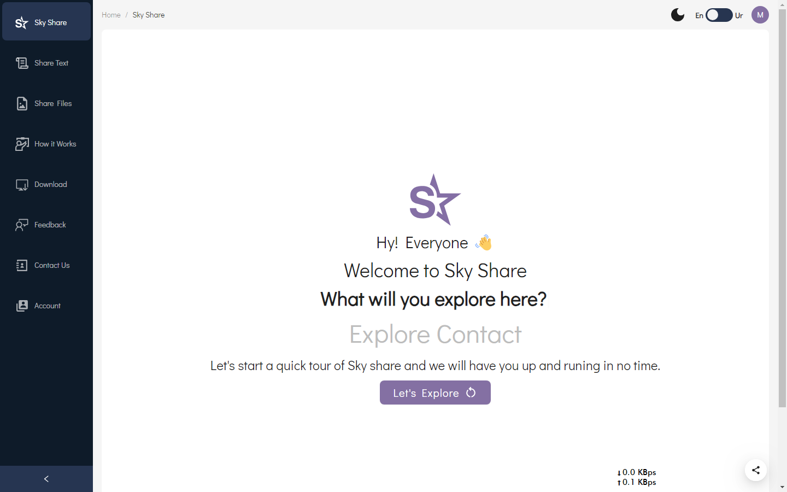
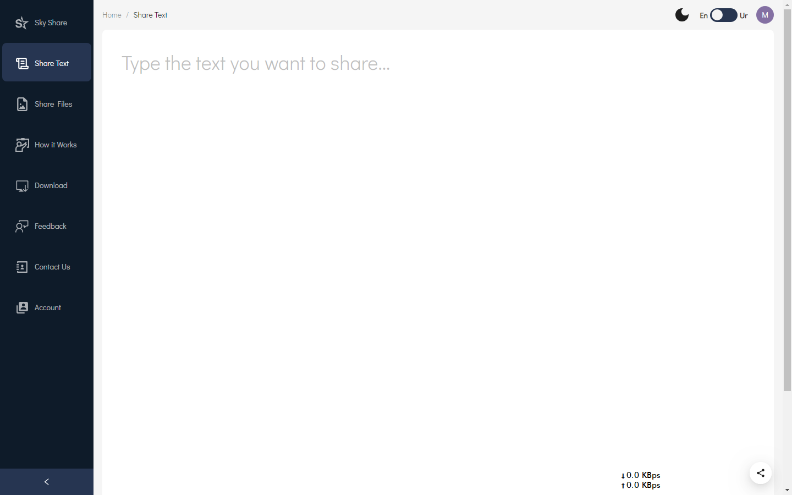
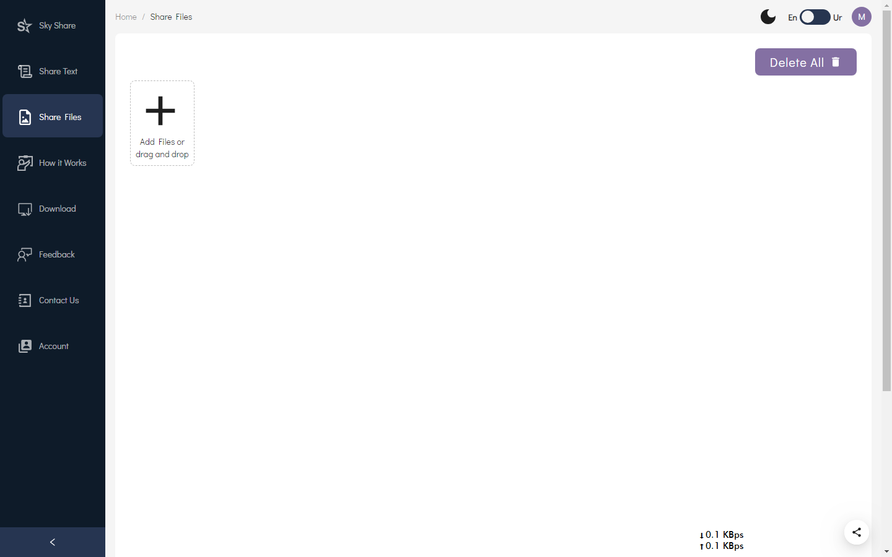
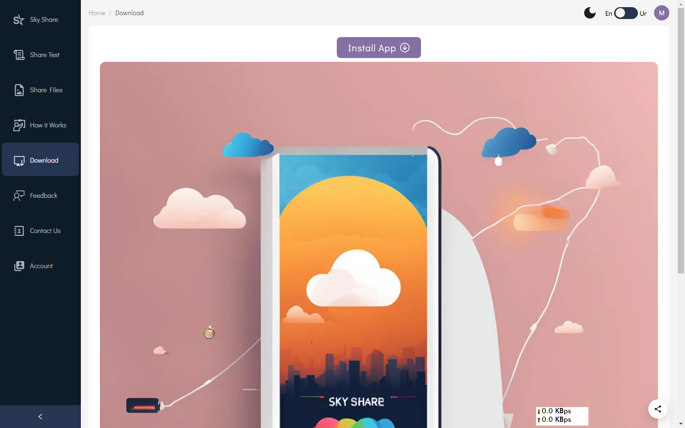
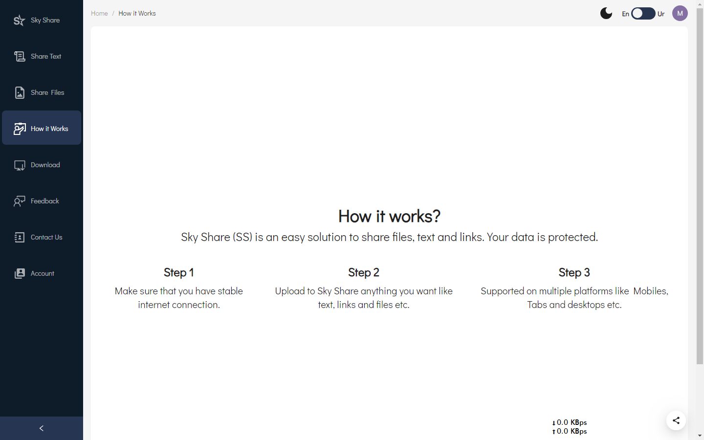
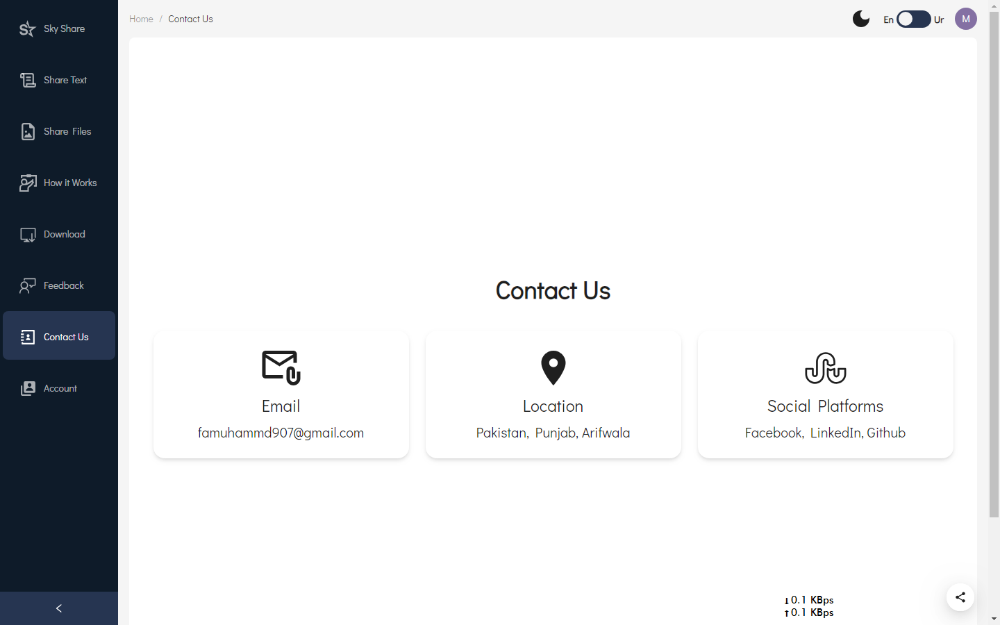
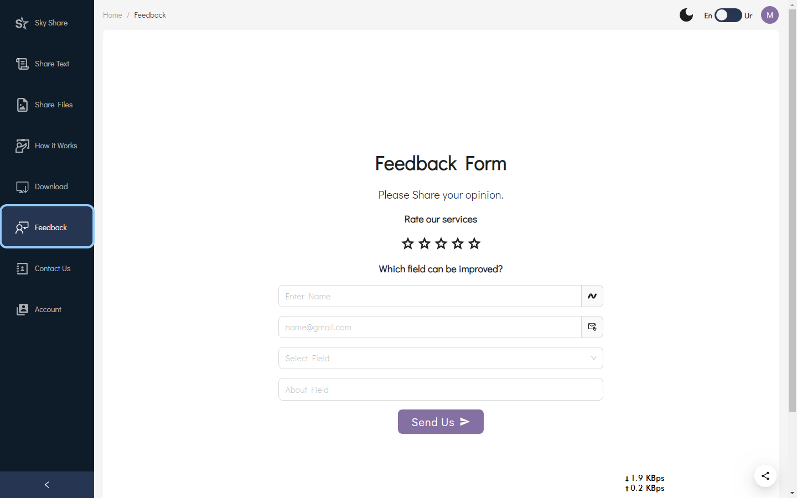
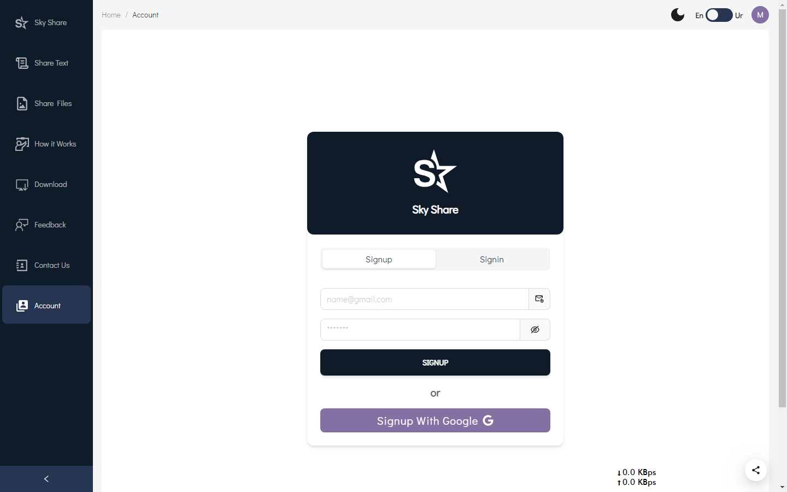

# Sky Share App

Sky Share App is a web application designed for seamless file sharing and collaboration. Built using React.js, Firebase Realtime Database, Ant Design, Material Tailwind, and Tailwind CSS, the application offers a modern and responsive user interface with robust real-time data handling.

## Features

- User Authentication (Sign Up, Sign In)
- File Upload and Management
- Real-time Data Synchronization
- User-specific File Management
- Multi-language Support
- Dark Mode Toggle

## Tech Stack

- **React.js**: JavaScript library for building user interfaces.
- **Firebase Realtime Database**: Real-time NoSQL database for storing and syncing data.
- **Ant Design**: React UI library for building modern web applications.
- **Material Tailwind**: Integration of Material Design with Tailwind CSS for styling.
- **Tailwind CSS**: Utility-first CSS framework for rapid UI development.

## Installation

1. Clone the repository:

   ```bash
   git clone https://github.com/Farooq85-dev/Sky-Share-App-Using-React-JS
   cd sky-share-app
   ```

2. Install dependencies:
   ` npm install`
3. Set up Firebase:

Create a Firebase project in the Firebase Console.
Add your Firebase configuration to a .env file in the root directory:

```
VITE_APP_FIREBASE_API_KEY=your_api_key
VITE_APP_FIREBASE_AUTH_DOMAIN=your_auth_domain
VITE_APP_FIREBASE_DATABASE_URL=your_database_url
VITE_APP_FIREBASE_PROJECT_ID=your_project_id
VITE_APP_FIREBASE_STORAGE_BUCKET=your_storage_bucket
VITE_APP_FIREBASE_MESSAGING_SENDER_ID=your_messaging_sender_id
VITE_APP_FIREBASE_APP_ID=your_app_id
```

4. Start the development server:

`npm run dev `

5. Open your browser and navigate to http://localhost:3000.

## Welcome Page



## Share Text Page



## Share Files Page



## Download Page



## How it works Page



## Contatct Page



## Feedback Page



## Account Page



## Usage

### User Authentication

- Users can sign up and log in using email and password or Google authentication.
- User-specific data is managed using Firebase Authentication and Realtime Database.

### File Management

- Users can upload files to the application, which are stored in Firebase Storage.
- Uploaded files are associated with the user and can be managed (viewed, deleted) within the application.

### Real-time Data Synchronization

- Changes in the data are synchronized in real-time across all connected clients using Firebase Realtime Database.

### Dark Mode and Multi-language Support

- The application supports dark mode, which can be toggled using the ThemeToggle component.
- Multi-language support is provided using react-i18next.

## Contributing

- Contributions are welcome! Please open an issue or submit a pull request if you have any improvements or new features to propose.

# Made with 💙 Muhammad Farooq
